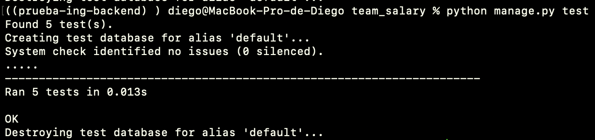

# Prueba Ingeniería Resuelve (backend)
This project is a proposed solution to the [**Prueba Ingeniería Resuelve**](https://github.com/resuelve/prueba-ing-backend).

## Description
This project exposes an endpoint to calculate the final salary of a list of teams and players.

## Requirements
* [Git](https://git-scm.com/downloads)
* [python 3.10](https://www.python.org/downloads/)

## Documentation 

Endpoint: /api/v1/team-salary/

Parameters:

    Name: jugadores
    Type: Array (json of players)
    Description: Inside the player array goes json object with this key value:

        Name: nombre 
        Type: Strig
        required: true

        Name: nivel
        Type: String
        required: true

        Name: goles
        Type: int
        required: true

        Name: sueldo
        Type:float
        required: true

        Name: bono
        Type:float
        required: true

        Name: sueldo_completo
        Type: null
        required: false

        Name: equipo
        Type: String
        required: true

Example:
```json
{
   "jugadores" : [  
      {  
         "nombre":"Juan Perez",
         "nivel":"C",
         "goles":10,
         "sueldo":50000,
         "bono":25000,
         "sueldo_completo":null,
         "equipo":"rojo"
      }
   ]
}
```

The goal of each level is according to the [rules](https://github.com/resuelve/prueba-ing-backend/blob/master/README.md#c%C3%B3mo-se-calculan-los-alcances-de-meta-y-bonos)

## Installation

1. We clone the project.

```bash
git clone https://github.com/tuticapi/prueba-ing-backend.git
```

2. We enter the project.
```bash
cd prueba-ing-backend
```

3. We change branches
```bash
git checkout production
```

4. We install pipenv.
```bash
pip3.10 install pipenv
```

5. We create the virtual environment and install the dependencies.
```bash
pipenv install
```

6. We activate the virtual environment.
```bash
pipenv shell
```

7. We run the migrations
```bash
python ./team_salary/manage.py migrate
```

8. We run the project.
```bash
python ./team_salary/manage.py runserver
```

## Let's play
We have a single endpoint: **/api/v1/team-salary/**

We can use the following postman [template](salary.postman.json) or,

We can make use of the curl command in the following way:

```bash
curl -X POST 'http://localhost:8000/api/v1/team-salary/' \
  -H 'Content-type: application/json' \
  -H 'Accept: application/json' \
  -d '{"jugadores" : [  
       {  
          "nombre":"Juan Perez",
          "nivel":"C",
          "goles":10,
          "sueldo":50000,
          "bono":25000,
          "sueldo_completo":null,
          "equipo":"rojo"
       },
       {  
          "nombre":"EL Cuauh",
          "nivel":"Cuauh",
          "goles":30,
          "sueldo":100000,
          "bono":30000,
          "sueldo_completo":null,
          "equipo":"azul"
       },
       {  
          "nombre":"Cosme Fulanito",
          "nivel":"A",
          "goles":7,
          "sueldo":20000,
          "bono":10000,
          "sueldo_completo":null,
          "equipo":"azul"
       },
       {  
          "nombre":"El Rulo",
          "nivel":"B",
          "goles":9,
          "sueldo":30000,
          "bono":15000,
          "sueldo_completo":null,
          "equipo":"rojo"
       }
    ]
 }'
```


## Testing

You can run the tests in the following way.

```bash
python manage.py test
```

This is evidence of the output after running the tests:



Note: If you are going to run it, remember to have the viurtual environment activated.

